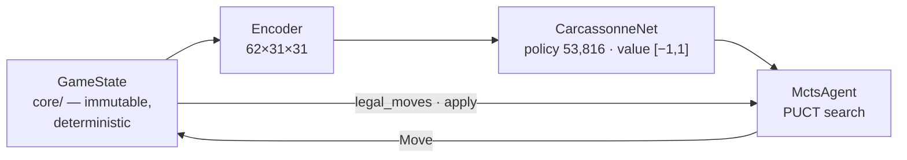
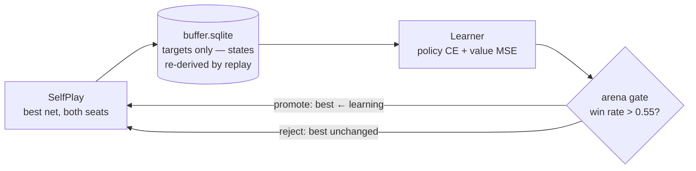
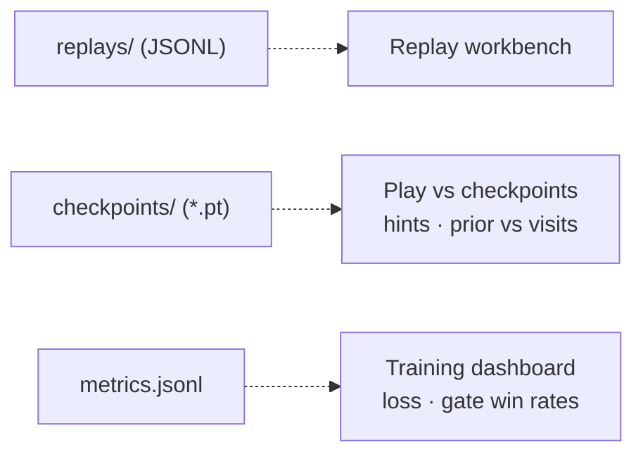

# meeplezero

AlphaZero-style self-play reinforcement learning for Carcassonne — small enough to train on a Raspberry Pi 5, instrumented so you can watch it think.

A pure, deterministic rules **Engine** (base game + abbots, no farmer scoring) feeds an AlphaGo-Zero-style loop: a policy/value residual CNN guides PUCT **MCTS**, self-play games fill a replay buffer, a learner trains on search visit distributions and ±1 game outcomes, and candidates are only promoted after beating the incumbent in a seat-swapped arena (win rate > 0.55). A FastAPI web app doubles as an **RL microscope**: play against checkpoints, inspect Prior vs. Visits per move, replay games, and watch training live.

## Quickstart

Requires Python ≥ 3.12 and [uv](https://docs.astral.sh/uv/).

```sh
uv sync --all-extras          # ml extra = torch (pinned 2.2.x for Intel macOS)
uv run pytest                 # 174 tests

# agent-vs-agent match, no training needed
uv run carcassonne evaluate --p0 greedy --p1 random --seed 0 --games 20

# start a resumable training run (arena-gates vs best + greedy yardstick built in)
uv run carcassonne train --run runs/first --sims 100 --selfplay-games 20
uv run carcassonne train --run runs/first --resume   # continue after any interruption

# play in the browser — vs. trained checkpoints, with replay viewer + training dashboard
uv run carcassonne serve --checkpoints runs/first/checkpoints
```

## How it fits together

**Choosing a move** — the inference path every agent turn takes:



**Training** — the AlphaZero loop, one iteration per cycle:



**The RL microscope** — every artifact the loop writes has a view in the web app:



The dependency rule matches the arrows: `core → game → agents/nn → training/web`, enforced one-way — the engine knows nothing about the network, and the RL stack consumes the engine only through its five-function API.

## The RL setup at a glance

| Piece | Design |
|---|---|
| Observation | 62×31×31 float tensor: 24 spatial planes + 38 broadcast scalars, current-player perspective (`nn/encode.py`) |
| Actions | flat space of 53,816 = 31·31 squares × 4 rotations × 14 sub-actions, illegal moves masked to −∞ (`nn/actions.py`) |
| Network | residual CNN, 64 channels × 5 blocks; policy head reshapes to action order, value head → tanh (`nn/model.py`) |
| Search | PUCT MCTS, no rollouts; Dirichlet root noise + opening temperature in self-play (`agents/mcts.py`) |
| Reward | terminal only: +1 win / −1 loss / 0 draw — no shaping (`training/selfplay.py`) |
| Buffer | sliding window of 2,000 games in SQLite; stores targets only, re-derives states by deterministic replay (`training/buffer.py`) |
| Gating | best net generates data; learner promoted only on arena win rate > 0.55, plus a greedy-agent yardstick (`training/arena.py`) |

A `TrainingRun` is just a directory (`config.json`, `checkpoints/`, `replays/`, `buffer.sqlite`, `metrics.jsonl`) — SIGTERM-safe and resumable, so a run started on a laptop continues on the Pi under systemd.

## Layout

```
carcassonne/
  core/       pure rules engine: five functions over an immutable GameState
  game/       match orchestration, arena, JSONL replays
  agents/     random · greedy · MCTS, one choose(state, ctx) protocol
  nn/         encoder, action indexer, network, checkpoints
  training/   self-play, buffer, learner, gating, resumable runs
  web/        FastAPI app: play, replay workbench, training dashboard
docs/         spec, ubiquitous language, plans, Pi setup
```

## Status

Iteration 1 is complete and verified: full 2-player engine, agents, training loop, and web UI. Designed but not yet built: 2–5 player engine, multiplayer RL (max^n search), multiprocess self-play, and the first multi-day Pi training campaign. See `docs/plans/`.

---

Carcassonne is a trademark of Hans im Glück. This is an unaffiliated research/learning project; it contains no assets from the published game.
